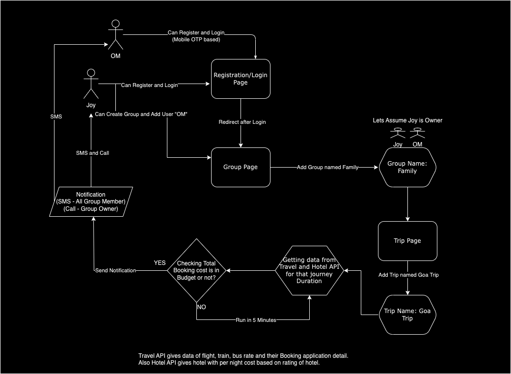

# Holiday Planner Web App

A web application for planning and managing holidays with multiple users and groups.

## Table of Contents

- [Introduction](#introduction)
- [Motivation](#motivation)
- [Features](#features)
- [Design](#design)
- [Technologies Used](#technologies-used)
- [Setup](#setup)
- [OTP Verification](#otp-verification)
- [Notification](#Notification) 
- [Usage](#usage)
- [List of APIs](#list-of-apis)

## Introduction

- The Holiday Planner Web App is designed to facilitate the planning and organization of trips with multiple users. It includes features such as user management, group creation, trip planning, budget management, and OTP verification for user registration.
- Also App Includes SMS and Call based notification system for budget management.

## Motivation
- In today's world, everyone is busy with their lives and often doesn't have the time to plan their holidays. That's why I came up with the idea of helping people plan their holidays with friends and family.
- Additionally, when planning a trip, prices for tickets and accommodations can fluctuate. Sometimes, they may decrease in the future, making it challenging to decide when to book. To address this, I developed an idea to provide notifications when prices decrease, along with information about booking platforms and trip details.

## Features

1. **User Management:**
   - User registration with mandatory fields in profile page(Name, Age, Gender, DOB, ContactNO, EmailID).
   - User login with mobile OTP authentication.
   - User profile management.

2. **Group Management:**
   - Create groups for trip planning.
   - List user's groups.
   - Retrieve group details.

3. **Trip Planning:**
   - Plan trips within groups.
   - Specify trip details (dates, source, destination, mode of travel, budget, etc.).
   - Update and delete trips.
   - Check expenses periodically.

4. **Budget Management:**
   - Check if trip expenses are within budget.
   - Send notifications if expenses fits under the budget. (Sent to all users in the group)
   - Call when expenses fits in the budget. (Call to owner of the group)

5. **OTP Verification:**
   - Secure user registration with OTP verification via SMS (4-digit code).

## Design

## Technologies Used

- **Frontend:** React, Redux
- **Backend:** Node.js, Express.js
- **Database:** MongoDB
- **Authentication:** Plivo SMS API for OTP

## Setup

1. Clone the repository.
2. Install dependencies for both the frontend and backend.
3. Configure environmental variables. (PLIVO_AUTH_ID, PLIVO_AUTH_TOKEN)
4. Run the application.

## OTP Verification

- Implement OTP verification during user registration using Plivo SMS API.

## Notification

- Implemeted SMS and Call based notification system for budget management using Plivo SMS and Call API.

## Usage

1. Register as a user and complete your profile.
2. Create or join a group for trip planning.
3. Plan trips, specifying details such as dates, source, destination, and budget.
4. Check expenses regularly to ensure they are within budget.
5. Receive notifications if budget fits under your budget.

## List of APIs
- User Registration: `POST /api/register`
- User Login: `POST /api/login`
- User Profile: `GET /api/user/profile`
- User Update Profile: `PUT /api/user/profile`
- Create a Group: `POST /api/groups`
- List User's Groups: `GET /api/groups`
- Group Details: `GET /api/groups/:groupId`
- Plan a Trip: `POST /api/groups/trips/:groupId`
- List Trips: `GET /api/groups/trips`
- Trip Details: `GET /api/groups/trips/:tripId`
- Update Trip: `PUT /api/groups/trips/:tripId`
- Delete Trip: `DELETE /api/groups/trips/:tripId`
- List Detail of a Trip: `GET /api/tripBookedData/:tripId`
